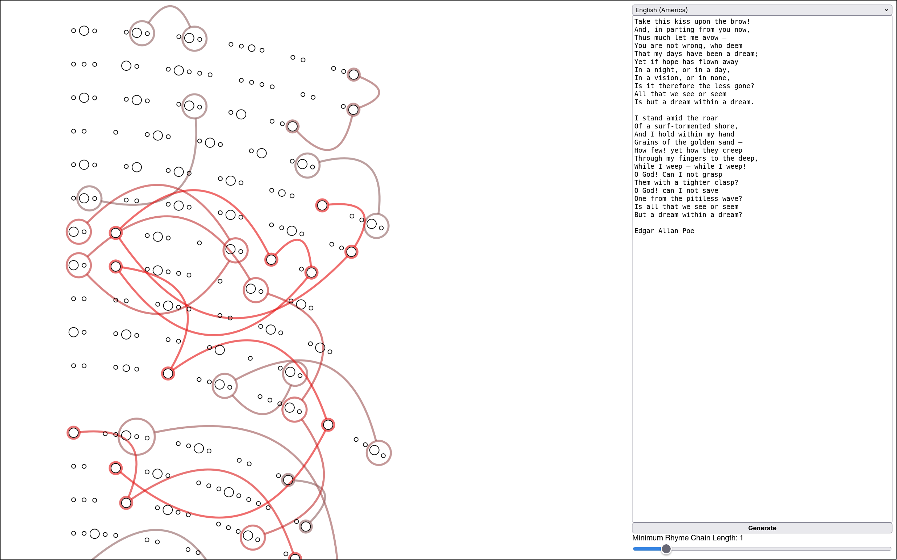

# Rhyme Mapper


Rhyme Mapper is a tool for visual exploration of phonetic structure of a text.

Designed to primarily to work with poems


## Installation and usage

### Pip
    [!NOTE]
    PyPI package coming soon.

### Docker

```sh
docker pull rhyme-mapper
```
## Roadmap

## Attributions

Phonemization in Rhyme Mapper is done using [Phonemizer](https://github.com/bootphon/phonemizer?tabglp+lisence=GPL-3.0-1-ov-file&tab=readme-ov-file) library.

```bibtex
@article{Bernard2021,
doi = {10.21105/joss.03958},
url = {https://doi.org/10.21105/joss.03958},
year = {2021},
publisher = {The Open Journal},
volume = {6},
number = {68},
pages = {3958},
author = {Mathieu Bernard and Hadrien Titeux},
title = {Phonemizer: Text to Phones Transcription for Multiple Languages in Python},
journal = {Journal of Open Source Software}
}
```